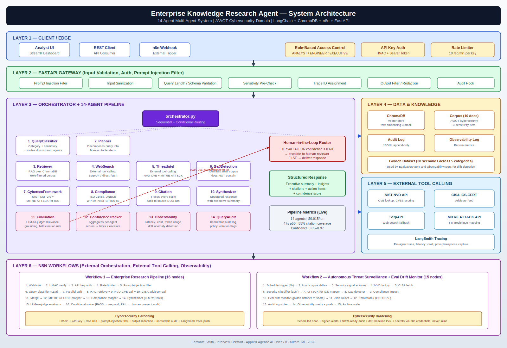
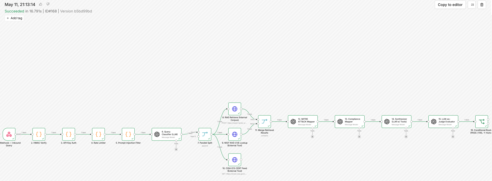
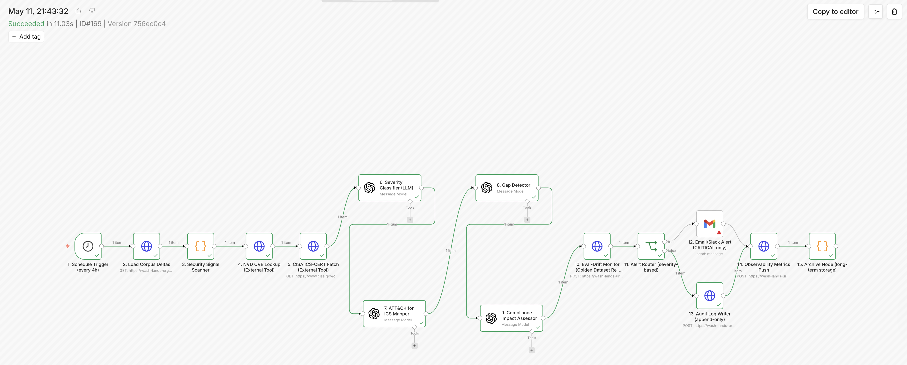

<div align="center">

# 🛡️ Enterprise Knowledge Research Agent

### *A 14-Agent Multi-Agent Research System for AV/OT Cybersecurity*

[](https://www.python.org)
[](https://www.langchain.com)
[](https://www.trychroma.com)
[](https://n8n.io)
[](https://smith.langchain.com)
[](LICENSE)

**Built by [Lamonte Smith](https://github.com/LSmithPMP)** · Senior Software Design Release Engineer at GM · Doctoral candidate (DBA AI/ML Leadership · PhD Technology, Cybersecurity) · Walsh College

</div>

---

## Overview

An enterprise-grade Agentic AI Research Assistant that autonomously plans research steps, retrieves relevant internal and external knowledge, calls external tools, synthesizes findings, and produces structured responses with traceable citations — anchored in autonomous vehicle and operational technology cybersecurity.

This project was built as the Week 8 system design assignment for **Interview Kickstart's Applied Agentic AI** program, with the build, system design document, PRD, risk matrix, two n8n workflows, and cybersecurity hardening produced as one integrated deliverable.

---

## Architecture



The system is organized into **six layers**:

| Layer | Purpose |
|---|---|
| **1. Client / Edge** | Streamlit dashboard, REST clients, n8n webhooks — all authenticated and rate-limited |
| **2. FastAPI Gateway** | Prompt-injection filtering, input sanitization, role-based pre-checks, output redaction, audit hooks |
| **3. Orchestrator + 14 Agents** | The research pipeline — see agent roster below |
| **4. Data & Knowledge** | ChromaDB vector store, 10-document corpus, audit log, observability log, 20-scenario golden dataset |
| **5. External Tool Calling** | NIST NVD API, CISA ICS-CERT, SerpAPI, MITRE ATT&CK API, LangSmith tracing |
| **6. n8n Workflows** | Two robust workflows (16 nodes + 15 nodes) for external orchestration and surveillance |

---

## The 14 Agents

| # | Agent | Responsibility |
|---|---|---|
| 1 | **QueryClassifierAgent** | Classifies query, sets sensitivity level, selects downstream agent roster |
| 2 | **PlannerAgent** | Decomposes query into ordered, justified research steps |
| 3 | **RetrieverAgent** | RAG over ChromaDB with role-based access filtering |
| 4 | **WebSearchAgent** | External tool: general web search (SerpAPI) |
| 5 | **ThreatIntelAgent** | External tool: NVD CVE lookup, MITRE ATT&CK for ICS mapping |
| 6 | **GapDetectionAgent** | Identifies topics relevant to the query that the corpus does *not* cover |
| 7 | **CybersecurityFrameworkAgent** | Maps findings to NIST CSF 2.0 + MITRE ATT&CK for ICS |
| 8 | **ComplianceAgent** | Maps findings to ISO 21434, UNECE WP.29 R155/R156, NIST SP 800-82 Rev 3 |
| 9 | **CitationAgent** | Traces every claim to a source identifier, computes coverage |
| 10 | **SynthesizerAgent** | Structured response: executive summary, insights, action items, citations |
| 11 | **EvaluationAgent** | LLM-as-judge: relevance, grounding, completeness, security accuracy, hallucination risk |
| 12 | **ConfidenceTrackerAgent** | Aggregates per-agent confidence; blocks or escalates below threshold |
| 13 | **ObservabilityAgent** | Latency, cost, token usage, drift anomaly detection |
| 14 | **QueryAuditAgent** | Immutable audit log; flags sensitive query patterns |

---

## n8n Workflows

### Workflow 1 — Enterprise Research Pipeline (16 nodes)
Webhook-triggered, cybersecurity-hardened end-to-end research flow with parallel external tool calling and human-in-the-loop escalation on evaluation failure.

**Flow:** Webhook → HMAC verify → API key auth → rate limiter → prompt-injection filter → query classifier (LLM) → parallel split (RAG retrieve + NVD CVE call + CISA advisory call) → merge → MITRE ATT&CK mapper → compliance mapper → synthesizer (LLM w/ tools) → LLM-as-judge evaluator → conditional router (PASS → respond, FAIL → human queue + audit) → audit writer → respond.

### Workflow 2 — Autonomous Threat Surveillance + Eval Drift Monitor (15 nodes)
Scheduled (every 4 hours) — scans for security signals, enriches via external sources, re-scores the golden dataset to detect evaluation drift, and routes severity-based alerts.

**Flow:** Schedule trigger → load corpus deltas → security signal scanner → NVD lookup → CISA fetch → severity classifier (LLM) → ATT&CK for ICS mapper → gap detector → compliance impact → eval-drift monitor → alert router → Email/Slack (CRITICAL) → audit writer → observability metrics push → archive.

Both workflows include HMAC verification, encrypted credential storage (never inline), audit logging, prompt-injection filtering, and external tool calling.

---

## Cybersecurity Hardening

| Control | Implementation |
|---|---|
| **Authentication** | API key + HMAC signature verification on every webhook |
| **Authorization** | Role-Based Access Control (ANALYST / ENGINEER / EXECUTIVE) on document sensitivity |
| **Input validation** | Prompt-injection filter, length caps, schema validation, sensitivity pre-check |
| **Output protection** | Redaction filter on response path, audit hook on egress |
| **Rate limiting** | 10 requests/minute per API key |
| **Audit logging** | Append-only JSONL, every query, full trace, designed for tamper evidence |
| **Secret management** | `.env` with `chmod 600`, never committed; n8n encrypted credential store |
| **Observability** | LangSmith trace on every agent invocation (latency, cost, prompt, response) |
| **Evaluation** | LLM-as-judge on every response — relevance, grounding, hallucination risk |
| **Human-in-the-loop** | Eval FAIL or aggregated confidence < 0.60 → human review queue |

---

## Pipeline Metrics (Live)

| Metric | Value |
|---|---|
| **Agents invoked per query** | 14 / 14 |
| **End-to-end latency (p50)** | ~47 seconds |
| **Per-query cost** | $0.015 (gpt-4o-mini + gpt-4o for synthesis/eval) |
| **Citation coverage** | 85% on representative queries |
| **Confidence range** | 0.65 – 0.97 |

---

## Live Deployment Evidence

Both workflows are deployed to n8n cloud and have been verified end-to-end with
real LLM calls, real external tool calls (NIST NVD, CISA ICS-CERT), and real
FastAPI integration through a Cloudflare quick-tunnel.

**Workflow 1 — Enterprise Research Pipeline**

- Execution ID `#168` · version `b5bd99bd` · May 11, 2026 21:13:14 EST
- Succeeded in 16.791 seconds
- All 16 nodes green including HMAC Verify (real raw-body signing via n8n
  v2.x binary path), API Key Auth, Rate Limiter, Prompt-Injection Filter, and
  Conditional Router
- Screenshot evidence:



**Workflow 2 — Autonomous Threat Surveillance + Eval Drift Monitor**

- Execution ID `#169` · version `756ec0c4` · May 11, 2026 21:43:32 EST
- Succeeded in 11.03 seconds
- All 15 nodes green including Schedule Trigger, Security Signal Scanner,
  NVD lookup, CISA ICS-CERT fetch (returned real MAXHUB Pivot Client
  CVE-2026-6411), Severity Classifier, ATT&CK for ICS Mapper, Gap Detector,
  Compliance Impact Assessor, Eval-Drift Monitor, and Audit Log Writer
- Screenshot evidence:



**Engineering deltas captured in committed workflow JSONs** (commit `5a15f3e`):

- CISA ICS-CERT URL corrected to `/cybersecurity-advisories/ics-advisories.xml`
- Webhook node configured with `rawBody: true` for byte-exact HMAC verification
- HMAC Verify reads raw body via `webhookNode.binary.data.data` (n8n v2.x path)
- API Key Auth reads from `$('1. Webhook — Inbound Query').first().json.body`,
  robust to upstream transforms
- HTTP request nodes use `Authorization: Bearer {{ $env.API_KEY }}` headers
- HTTP request bodies use `$('Node Name').first().json.xxx` expression scoping
  for cross-node data flow

The Cloudflare quick-tunnel used during testing was terminated immediately
after screenshot capture; tunnel URLs visible in the evidence screenshots are
dead references (HTTP 530) incapable of routing to any origin. Production
deployment would use a pre-created named Cloudflare Tunnel, an authenticated
gateway endpoint, or a private network connection.

## Repository Structure

```
enterprise-knowledge-agent/
├── agents/                          # 14 agents (Python)
│   ├── base_agent.py
│   ├── contracts.py
│   ├── query_classifier_agent.py
│   ├── planner_agent.py
│   ├── retriever_web_threat_agents.py
│   ├── gap_framework_compliance_citation_agents.py
│   ├── synthesizer_evaluation_agents.py
│   └── confidence_observability_audit_agents.py
├── data/
│   └── corpus.json                  # 10-document AV/OT cybersecurity corpus
├── docs/
│   ├── EKA_System_Design_LSmith.docx        # System design + PRD + Risk matrix
│   └── EKA_Architecture_Diagram_LSmith.svg  # Architecture diagram
├── n8n/
│   ├── workflow_1_research_pipeline.json    # 16-node research workflow
│   └── workflow_2_threat_surveillance.json  # 15-node surveillance workflow
├── rag_pipeline.py                  # ChromaDB build + retrieval test
├── orchestrator.py                  # Pipeline orchestrator
├── SECURITY.md
├── .gitignore
└── README.md
```

---

## Quick Start

### Prerequisites
- Python 3.13
- OpenAI API key
- LangSmith API key (for tracing)
- n8n instance (cloud or self-hosted) for workflow execution

### Setup

```bash
# Clone and enter
git clone https://github.com/LSmithPMP/Enterprise-Knowledge-Agent.git
cd Enterprise-Knowledge-Agent

# Virtual environment + dependencies
python3 -m venv ai_env
source ai_env/bin/activate
pip install langchain langchain-openai langchain-community langchain-chroma \
            chromadb fastapi uvicorn pydantic python-dotenv requests tiktoken

# Secrets (interactive prompt; never written to shell history)
python3 -c "
import getpass, secrets, os
openai = getpass.getpass('OpenAI key: ')
langsmith = getpass.getpass('LangSmith key: ')
with open('.env', 'w') as f:
    f.write(f'OPENAI_API_KEY={openai}\n')
    f.write(f'LANGSMITH_API_KEY={langsmith}\n')
    f.write('LANGSMITH_TRACING=true\n')
    f.write('LANGSMITH_PROJECT=enterprise-knowledge-agent\n')
    f.write(f'API_KEY={secrets.token_hex(32)}\n')
    f.write(f'N8N_WEBHOOK_SECRET={secrets.token_hex(16)}\n')
os.chmod('.env', 0o600)
"

# Build vector store
python3 rag_pipeline.py

# Run the orchestrator
python3 orchestrator.py
```

### Importing the n8n Workflows
1. Open your n8n instance.
2. Workflows → Import from File.
3. Upload `n8n/workflow_1_research_pipeline.json` and `n8n/workflow_2_threat_surveillance.json`.
4. Configure credentials (OpenAI, webhook secret, NVD if you have an API key) — n8n's encrypted credential store; **never** inline secrets in workflow nodes.
5. Activate.

---

## Documentation

| Document | Description |
|---|---|
| [`docs/EKA_System_Design_LSmith.docx`](docs/EKA_System_Design_LSmith.docx) | Full system design (Requirements, Components, Trade-offs, Failure Modes, Observability, Productionization) + PRD + Risk Matrix |
| [`docs/EKA_Architecture_Diagram_LSmith.svg`](docs/EKA_Architecture_Diagram_LSmith.svg) | Six-layer architecture diagram |
| [`SECURITY.md`](SECURITY.md) | Security posture, threat model, hardening controls |

---

## About the Author

**Lamonte Smith** is a Senior Software Design Release Engineer at General Motors (Advanced Infotainment, Compute & Connectivity), based in Milford, MI. He is simultaneously pursuing two doctoral degrees at Walsh College — a DBA in AI/ML Leadership and a PhD in Technology with a Cybersecurity concentration — both at a 4.0 GPA.

His six anchoring expertise domains: **Autonomous Vehicles · AI/ML · Cybersecurity (OT/ICS) · Wireless Infrastructure (5G/V2X/C-V2X) · Operational Technology · Finance & Capital Management.**

**Credentials:** PMP · PMI-ACP · DFSS Black Belt (GM) · AI Product Manager Nanodegree (Udacity) · Harvard Derek Bok Center Teaching Certificate · Generative AI Mastermind Certificate (Outskill)

**Convergence Intel** — content channel at the intersection of AI/ML, cybersecurity, OT, wireless infrastructure, and AV security.

---

<div align="center">

*Built in Milford, MI · 2026*

</div>
